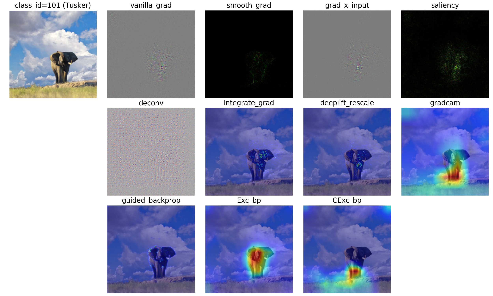

# Pytorch Visual Attribution Methods

A collection of visual attribution methods for model interpretability



Including:
- [x] Vanilla Gradient Saliency
- [x] Grad X Input
- [x] Integrated Gradient
- [x] SmoothGrad
- [x] Guided Backpropagation
- [x] Excitation Backpropagation, Contrastive Excitation Backpropagation
- [x] GradCAM
- [x] DeepLIFT
- [x] Deconv
- [ ] PatternNet, PatternLRP
- [ ] Real Time Saliency
- [ ] Occlusion
- [ ] Feedback
- [ ] Meaningful Perturbation

## Setup

### Prerequisities
- Linux
- NVIDIA GPU + CUDA (Current only support running on GPU)
- Python 3.x
- PyTorch version == 1.3 
- torchvision, skimage, matplotlib

modify torchvision:
Modify from PIL import Image, ImageOps, ImageEnhance, PILLOW_VERSION to from PIL import Image, ImageOps, ImageEnhance, __version__ in functional.py

### Getting Started
- Clone this repo:
```bash
git clone https://github.com/jhammelman/visual-attribution.git
cd visual-attribution
git checkout any_input_CNN
```
- Run for images on vgg net
python saliency_comparison.py


## Citation
If you use our codebase or models in your research, please cite this project.
```bibtex
@misc{visualattr2018,
  author =       {Yulong Wang},
  title =        {Pytorch-Visual-Attribution},
  howpublished = {\url{https://github.com/yulongwang12/visual-attribution}},
  year =         {2018}
}
```
